# Workspaces a Visual Studio Code

> Un **workspace** (_espai de treball_) **és simplement una carpeta o directori**, dins del qual hi ubicarem tots els fitxers del nostre programa o programes.

Podem arrencar _Visual Studio Code_ des de l'entorn _jupyter classic notebook_ des del menú ``New > VS Code``:

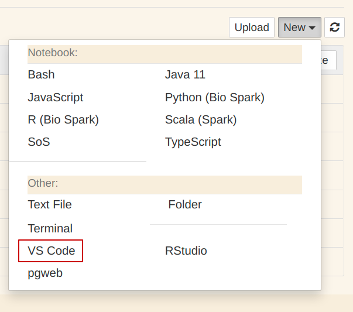

o bé des de l'entorn _jupyter lab_ clicant a l'icona de _VS Code_:

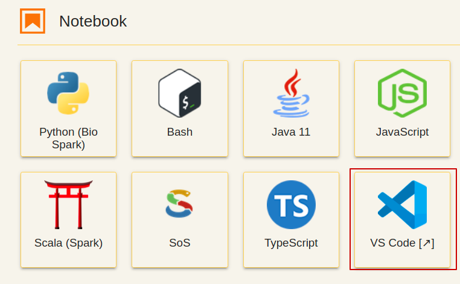

_VS Code_ se'ns obrirà en una nova pestanya amb el _workspace_ per defecte corresponent a la carpeta ~/workspaces:

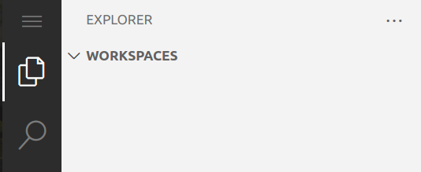

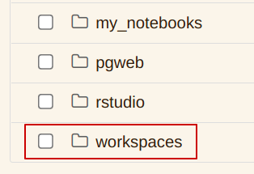

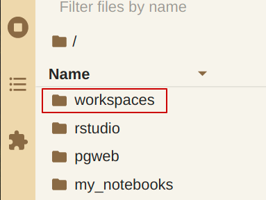

## Creació d'un workspace per a projectes Java

Des del mateix _workspace_ per defecte (~/workspaces) anem al menú i cliquem a:

```
File > Save Workspace As ...
```

Li donem el nom que apareix en la següent imatge:

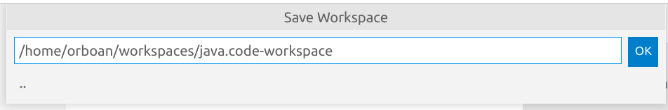

Amb aquesta acció generarem un fitxer on es guardaran totes les propietats del _workspace_ que hem anomenat ``java.code-workspace``. Aquest fitxer quedarà guardat a _~/workspaces_.

> El fitxer ``java.code-workspace`` correspon a un _workspace_ configurable amb múltiples carpetes.

Per defecte, un _workspace_ correspon a una carpeta o directori. Però també podem crear un _workspace_ amb múltiples carpetes, cadascuna que pugui correspondre a un **projecte java** diferent.

Un cop acabada l'acció de ``Save Workspace As ...`` el vscode es recarregarà automàticament amb el nou _workspace_:

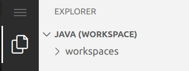

Podem observar com aquest _workspace_ conté una carpeta anomenada ``workspaces``. Per què?

Des del mateix vscode, cliquem al fitxer ``java.code-workspace``:

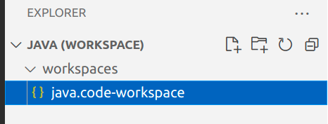

I se'ns obrirà una pestanya dins del vscode on podem veure els continguts d'aquest fitxer:

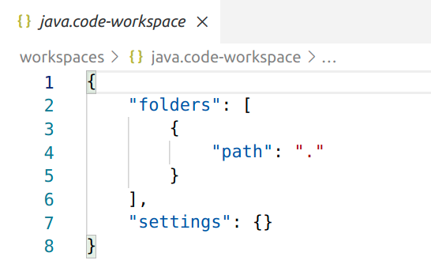

Aquest és un fitxer _json_ en el qual hi ha una clau, anomenada _folders_ que té per valors una llista. **Aquesta és la llista de carpetes de què està compost aquest _workspace_**.

Com que el fitxer ``java.code-workspace`` està ubicat a ``~/workspaces`` i el _path_ de la carpeta que hi ha és ``.`` en resulta que la carpeta ``~/workspaces`` forma part d'aquest _workspace_.


## Configuració de les carpetes al workspace Java

> **Tots els projectes Java desenvolupats amb _vscode_ els posarem a ``~/workspaces/java``**. 

### Exemple: projecte ``HelloWorld``

Obrim el terminal a vscode:

```
Menú: Terminal > New Terminal
``` 

i creem la carpeta ``~/workspaces/java/HelloWorld``:

```bash
mkdir -p ~/workspaces/java/HelloWorld
```

A continuació, i des del mateix vscode, editem el fitxer ``java.code-workspace`` de la següent manera:

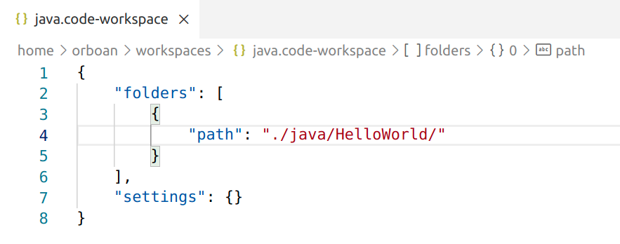

I el vscode es recarregarà mostrant el _workspace_ de java incloent-hi la nova carpeta ``HelloWorld``:

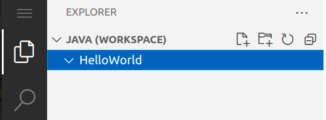

## Creació d'un projecte Java

La carpeta ``HelloWorld``de l'exemple anterior (ubicada al _workspace_ de Java) encara no és un projecte de Java. Per a que així sigui, primer **cal activar Java a vscode**.

Per a fer-ho, creem un fitxer ``.java`` dins de la carpteta ``HelloWorld``:

```
Menú contextual sobre HelloWorld a la vista Explorer > New File
```

Li donem el nom ``Main.java``:

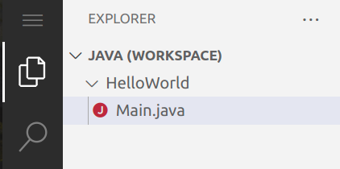

> En afegir un fitxer ``.java`` vscode activa automàticament les extensions necessàries per a treballar amb Java (si no estaven activades ja).

**Podeu observar com a vscode, a la part inferior esquerre de la finestra ``Explorer``, ha aparegut una nova secció anomenada ``Java Projects``, la qual ja conté el projecte Java ``HelloWorld``**. Ara, la carpeta ``HelloWorld`` que pertany al _workspace_ de Java **ja és un projecte Java**:

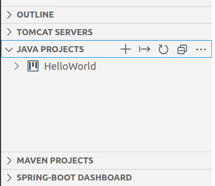

### Execució d'un programa en un projecte Java

Continuant amb l'exemple anterior (_HelloWorld_) editarem el fitxer ``Main.java`` afegint els següents continguts:

```java
public class Main {
    public static void main(String[] args){
        System.out.println("Hello World !!!");
    }
}
```

VSCode ens dóna l'opció d'executar (_run_) o depurar (_debug_) el programa directament en el codi:

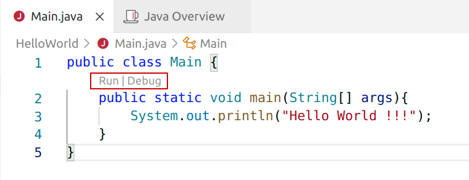

_Nota_: la _depuració_ de programes s'explica en un altre apartat d'aquest curs.

> Les opcions d'executar o depurar un programa directament des del codi, ens l'ofereix _vscode_ allà on està ubicat el punt d'entrada d'execució d'una aplicació Java, que és el mètode ``public static void main(String[] args)``.


També es pot executar el programa si cliquem al triangle que trobarem en desplegar el menú del projecte a la finestra de l'_Explorer_:

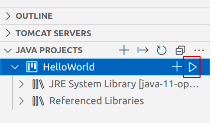


O també des de:

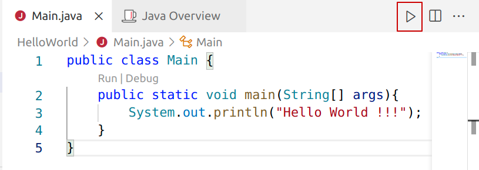

El resultat d'executar el programa del nostre projecte exemple _HelloWorld_ sortirà per pantalla. Aquesta pantalla és un nou terminal que s'obrirà dins del vscode. 

Això és així perquè el nostre programa _HelloWorld_ només fa això: imprimir el missatge _Hello World !!!_ per pantalla (la qual per defecte és el terminal o consola).

### Activació de les dreceres de teclat d'IntelliJ IDEA a VS Code

Seguint les passes de l'anterior exemple i un cop activada l'extensió de Java per a VS Code, apareixerà una pestanya (dins de VS Code) anomenada _Java Overview_.

A _Java Overview_ s'hi troba una secció anomenada **Key Bindings**. Cliquem a **_Use IntelliJ IDEA Key Bindings_**. 

> Activant les _key bindings_ d'IntelliJ IDEA podrem treballar programant Java amb VS Code usant les mateixes dreceres de teclat que amb l'IDE _IntelliJ IDEA_.

> IntelliJ IDEA és un dels IDEs més usats a nivell professional per a programar amb Java.

### Creació d'un projecte Java des del menú ``Java Projects``

En arrencar VS Code, s'obrirà per defecte a la carpeta _~/workspaces_. Per a obrir el workspace de Java hem de clicar a:


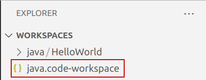

Un cop hem clicat sobre aquest fitxer, veurem els seus continguts en una nova pestanya dins del VS Code, dins de la qual apareix (a baix a la dreta) un botó "**Open Workspace**".

Una altra alternativa per a obrir el _workspace_ de Java, és anar al menú:

```
File > Open workspace
```

i escollir el fitxer ``java.code-workspace``:

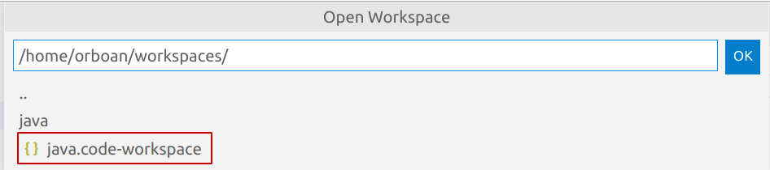

En obrir el nou workspace, el VS Code es recarregarà. Ara estem l'espai de treball (_workspace_) de Java, amb els projectes de Java que hi tinguem. **Aquest workspace és el lloc apropiat per a crear-hi nous projectes de Java**:


**Creem un nou projecte Java**: 


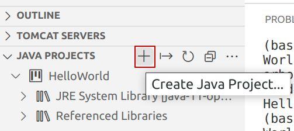


> Hem de seleccionar **la carpeta sota la qual es trobarà ubicat el nou projecte Java**, que serà ``~/workspaces/java/``.

**Sempre posarem els projectes Java sota de ``~/workspaces/java/``**.

Un cop seleccionat ``~/workspaces/java/`` cliquem a OK ...


... i a continuació escrivim el nom del nou projecte Java:


Se'ns obrirà, en una nova pestanya del navegador, una nova instància de VS Code amb un nou _workspace_ que té per nom el mateix nom del projecte Java que acabem de crear:

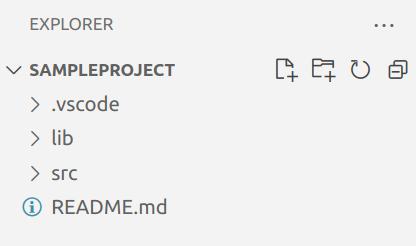

> Treballar sobre aquest workspace, corresponent a un únic projecte Java, és una opció. Però si volem tenir agrupats tots els projectes Java en un sol workspace, farem el següent:

A la instància de VS Code corresponent al _workspace_ java, anirem al menú i afegirem una nova carpeta al _workspace_, **escollint la carpeta corresponent al nou projecte Java que hem creat, és a dir, ``~/workspaces/java/SampleProject``:

```
Menú > File > Add Folder to Workspace ...
```

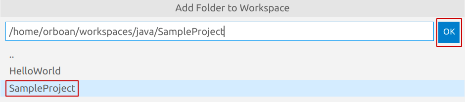

Ara, ja tenim els dos projectes Java (_HelloWorld_ i _SampleProject_) ubicats al mateix _workspace_:

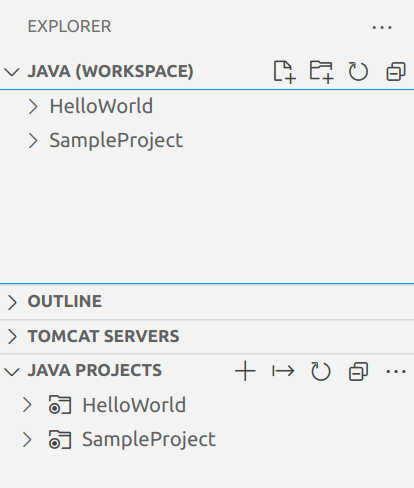


## Exercici: creació d'un _workspace_ multi projecte

En aquest exercici us demanem que, seguint les explicacions anteriors, creeu un _workspace_ destinat a agrupar tots els projectes Java que siguin **Pràctiques Avaluables de Java** d'aquest curs i dels cursos de programació.

> La ubicació arrel d'aquest _workspace_ ha de ser ``~/workspaces/java-ep/``

> Hi heu de crear 2 projectes Java, dins d'aquest workspace, anomenats "_M5_EP1_java_" i "_M5_EP2_java_". Heu de fer servir la plantilla _**No Build Tools**_ quan seleccioneu el tipus de projecte.

Amb la plantilla _No Build Tools_ el projecte Java que es genera és una simple impresió per pantalla de _Hello World!_. **Comproveu que els dos projectes s'executen correctament**.


